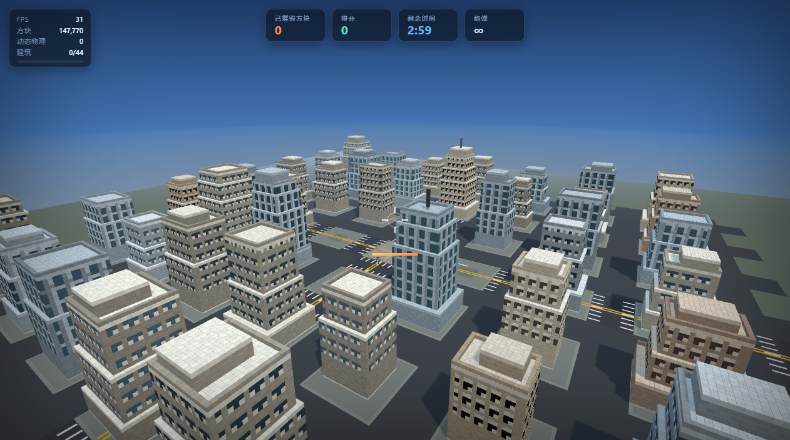
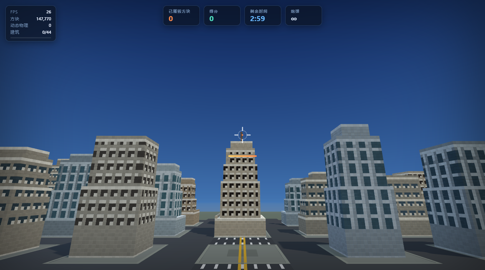
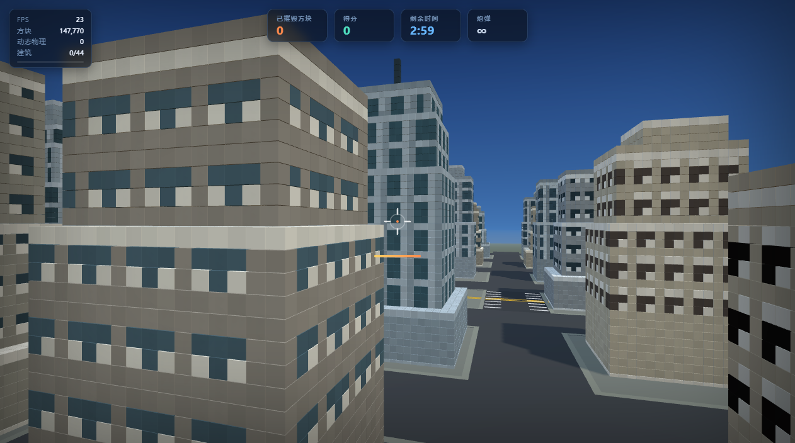
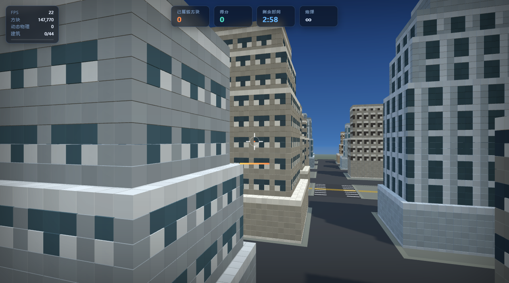
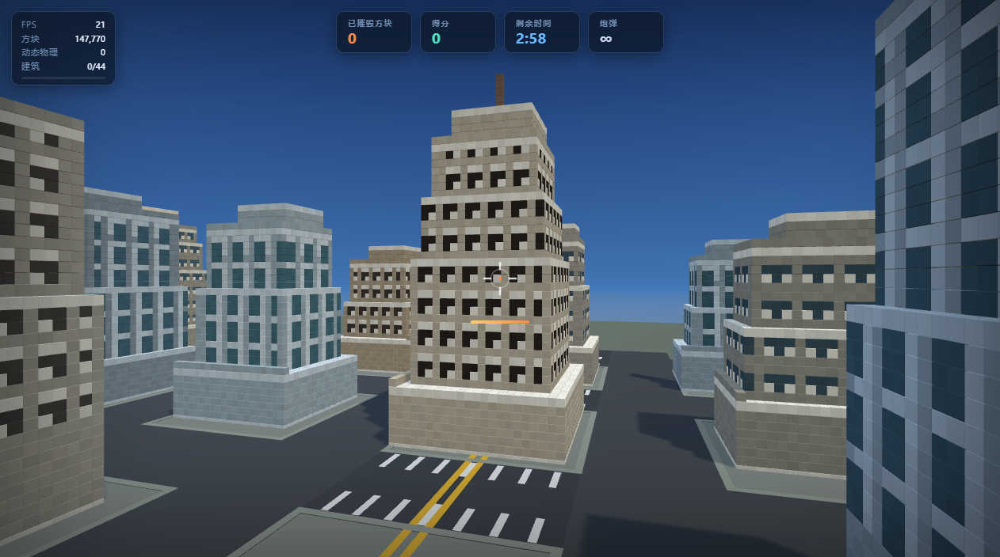

# 体素城市轰炸小游戏

<p align="center">
  
</p>

第三人称解压向小游戏：驾驶飞越体素城市的炮台，把整片现代居民区轰成漫天碎块。

浏览器直接打开 `index.html` 即可游玩 —— 单文件、零安装、无需本地服务器。

## 预览

| 全景 | 街景 |
|---|---|
|  |  |

| 玻璃幕墙塔楼 | 石材住宅 |
|---|---|
|  |  |

| 砖混住宅 | |
|---|---|
|  | |

## 玩法

| 按键 | 操作 |
|---|---|
| `W` / `A` / `S` / `D` | 移动 |
| 鼠标移动 | 环视 |
| 点击 / 空格 | 开炮 |

炮弹命中建筑后会炸出体素碎块，碎块受真实物理驱动抛物、落地、
短暂残留后淡出消散（飞行中的碎块也会在半空中逐渐化掉）。

## 技术要点

- **Three.js r160** 渲染 + **cannon-es 0.20** 物理脚本
- 全城体素以 5×5 chunk 合并为 InstancedMesh（每 chunk 1 个 draw call），
  路面贴地物按材质合并 —— 空闲时整城仅约 60 个 draw call
- 建筑按真实住宅规范生成：三段式立面（基座/主体/收头）、
  窗墙比参照 GB 55015-2021、封闭阳台带、4 类材质分色
- 结构坍塌双模型：承重损伤度（相对完好基线）+ 6 邻域连通性 BFS，
  中间打断后上方悬空块会整片坠落
- 碎块预分配对象池（2600 上限），寿命三段式：飞行硬寿命 / 落地残留 / 淡出

## 运行

```
git clone https://github.com/G-XiaJun/voxel-city-game.git
```

然后双击 `index.html`。修改源码请编辑 `game.js`
（`index.html` 内已内联打包同款逻辑，`file://` 协议可直接加载 CDN 依赖）。
